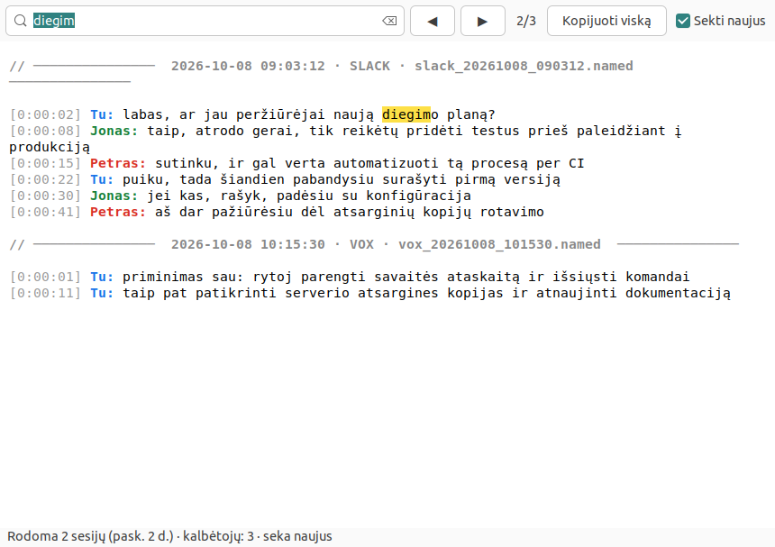

# Diktatūra 🎙️→📝

**Nemokamas, lokalus (privatus) balso-į-tekstą įrankis Linux vartotojams.**
Automatiškai įrašo Slack skambučius ar diktavimą, transkribuoja **lietuviškai**, atpažįsta
kalbėtojus **vardais** — ir viskas vyksta tavo kompiuteryje, niekur nesiunčiama.

> *Free, local, privacy-first Lithuanian speech-to-text for Linux. Auto-records Slack calls or
> dictation, transcribes in Lithuanian, labels speakers by name — 100% offline.*

Panašus į komercinius diktavimo įrankius, bet **atviras, nemokamas ir pilnai vietinis**.
Pavadinimas — kalambūras: *dikta*-vimas + *diktatūra* 🙂.

> ⚠️ Nesusijęs su jokiu komerciniu produktu. Naudoja atviro kodo modelius ir įrankius.

---

## Kaip atrodo

Gyvas transkripcijų langas — **atpažįsta žmones** (kiekvienas sava spalva), kaupia tekstą pagal
sesijas, su paieška ir kopijavimu:



**Status bar ikona** rodo, kas vyksta — pilka budi, raudona įrašo, geltona apdoroja:


*(Ekranuose — pavyzdiniai vardai ir tekstas, ne tikri duomenys.)*

---

## Ką daro

- 🤖 **Pats įsijungia** — aptinka Slack skambutį ir automatiškai pradeda/sustabdo įrašymą; veikia
  fone (systemd), startuoja po kompiuterio perkrovimo. Nereikia nieko spausti.
- 👥 **Atpažįsta žmones vardais** — iš balso („pirštų atspaudo"): tekste matai `Tu / Jonas / Petras: …`.
  Nežinomą balsą išsaugo; priskyrus vardą — ateity atpažįsta automatiškai.
- 📚 **Kaupia tekstą** — visos transkripcijos vienoje vietoje, gyvai pildosi, atskirtos pagal sesijas
  (data · VOX/SLACK). Laiko paskutines 2 dienas (senesnį automatiškai valo).

- 🎙️ **Auto-įrašymas** — aptinka Slack skambutį (PulseAudio) ir pats pradeda/sustabdo; arba
  **VOX** režimas (balso aktyvumas) diktavimui bet kada, be skambučio.
- 📝 **Transkripcija lietuviškai** — [Ąžuolas](https://huggingface.co/akisviete/azuolas-whisper-lt)
  (whisper-large-v3 + LIEPA-3) per faster-whisper (CT2, int8). Geriausia LT kokybė.
- 👥 **Kalbėtojų atpažinimas vardais** — stereo (tavo mikrofonas vs sistemos garsas) + diarizacija
  (sherpa-onnx, be torch) + balso registracija. Tekste: `Tu / Jonas / Petras: …`.
- 🌙 **Lankstus režimas** — iškart po skambučio arba naktinis paketinis transkribavimas (01:30).
- 🖥️ **Status bar ikona** (⚪/🔴/🟡) + **gyvas teksto langas** su paieška, spalvotais kalbėtojais,
  sesijų skyrikliais, kopijavimu (DI analizei).
- 💾 Po transkripcijos garsas suspaudžiamas į mp3 (vietos taupymui); tušti — ištrinami.

## Privatumas

Viskas vyksta **lokaliai**. Garsas, transkripcijos ir balso „pirštų atspaudai" niekada
neišeina iš tavo kompiuterio. Jokio debesies.

## Reikalavimai

- Linux (testuota Ubuntu 22.04, GNOME, X11), PulseAudio.
- `ffmpeg`, `python3`, [`uv`](https://github.com/astral-sh/uv), `make`.
- GNOME tray ikonai: `gir1.2-ayatanaappindicator3-0.1` + „AppIndicator" plėtinys.
- ~2 GB vietos modeliui (Ąžuolas CT2 int8 ≈ 1.5 GB). CPU pakanka (GPU nebūtina).

## Diegimas (apžvalga)

```bash
# 1. Aplinka + faster-whisper (ASR)
bash plans/A/setup.sh
# 2. Ąžuolo modelis -> CT2 (vienkartinė konversija, reikia torch laikinai)
bash plans/A/convert_azuolas.sh
# 3. Diarizacijos aplinka + modeliai (sherpa-onnx)
#    (žr. plans/F/ — venv + modelių parsisiuntimas į models/diarization/)
# 4. systemd servisai (auto-įrašymas, ikona, naktinis timer)
make install          # įjungia įrašymo daemon (startuos po perkrovimo)
make tray-on          # status bar ikona
```

## Naudojimas

```bash
make status               # kas vyksta: režimas, įrašai, RAM
make mode-slack           # 💬 Slack skambučių aptikimas
make mode-vox             # 🎙️ balso aktyvumas (diktavimui, be Slack)
make immediate | defer    # transkribuoti iškart / naktį (01:30)
make transcribe-pending   # sutranskribuoti viską dabar
make help                 # visos komandos
```

### Kalbėtojų vardai

```bash
make name-unknown                 # nežinomi balsai (pavyzdžiai), laukiantys vardo
paplay ~/<repo>/speakers/pending/nez3.wav   # paklausyti
make assign ID=nez3 NAME=Jonas    # priskirti vardą (įsimenamas ateičiai)
```
Nežinomas balsas automatiškai išsaugo pavyzdį; priskyrus vardą, ateities transkripcijos
jį atpažins. Balsai laikomi lokaliai (`speakers/`, **neversijuojama**).

## Architektūra (trumpai)

- `scripts/` — daemon'ai (auto-įrašymas, VOX), tray ikona, teksto langas, pipeline.
- `plans/A/` — ASR (faster-whisper + Ąžuolas): transkripcija, vardų priskyrimas.
- `plans/F/` — kalbėtojų atpažinimas (sherpa-onnx diarizacija + balso embeddingai).
- `Makefile` — visas valdymas. `wispr.conf` — nustatymai.

## Padėka / modeliai

- Ąžuolas (LT ASR) — `akisviete/azuolas-whisper-lt` (whisper-large-v3 + LIEPA-3).
- [faster-whisper](https://github.com/SYSTRAN/faster-whisper), [sherpa-onnx](https://github.com/k2-fsa/sherpa-onnx).

## Licencija

MIT (žr. `LICENSE`). Modeliai — pagal jų atskiras licencijas.
