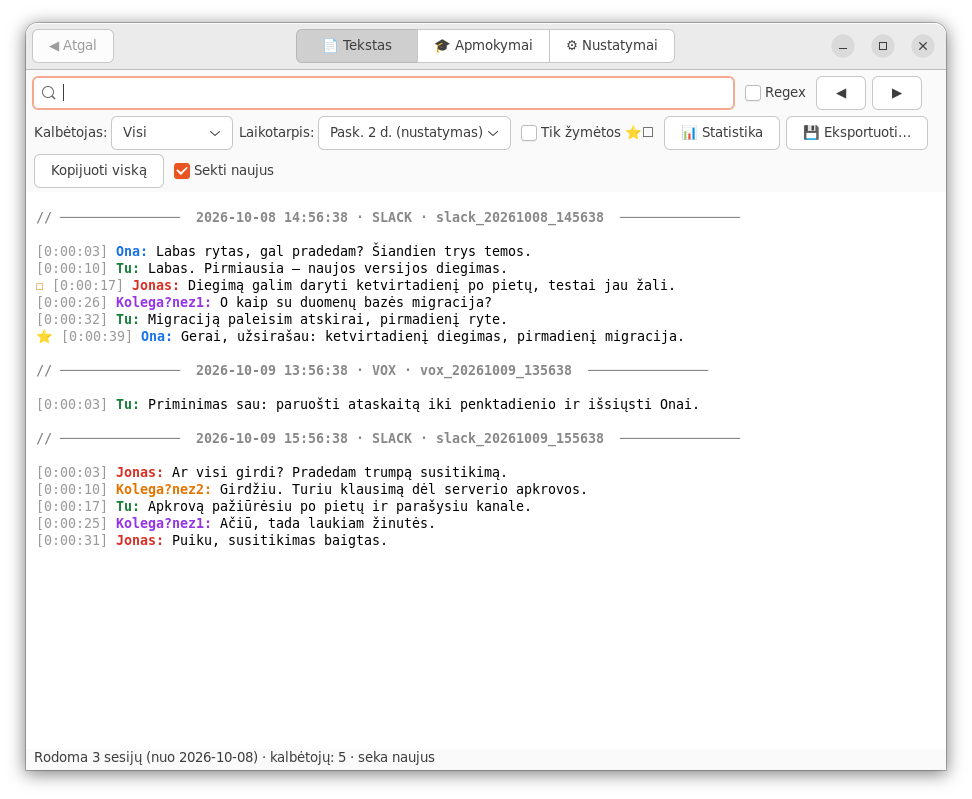
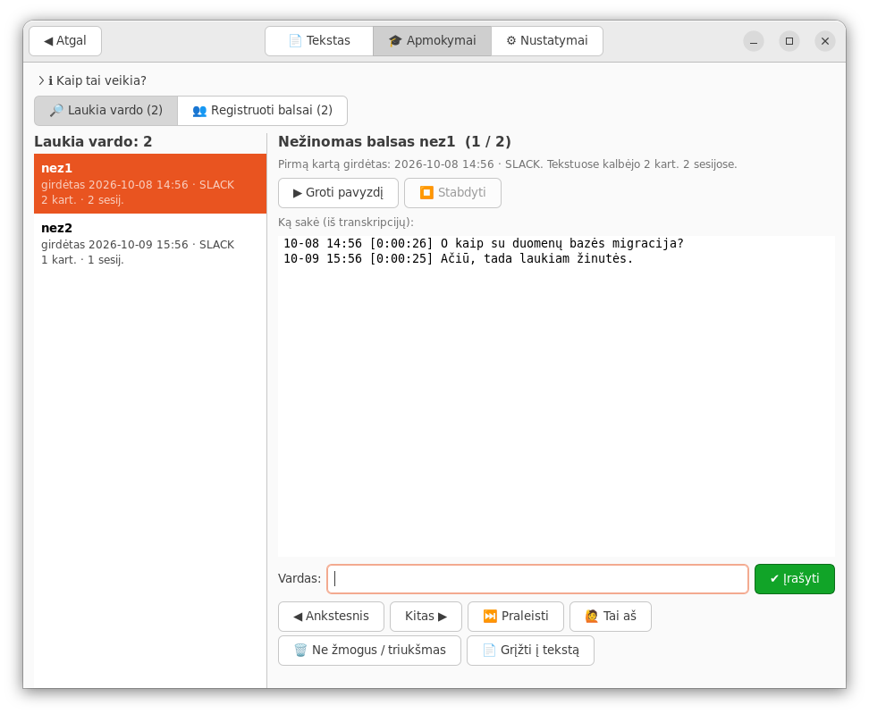
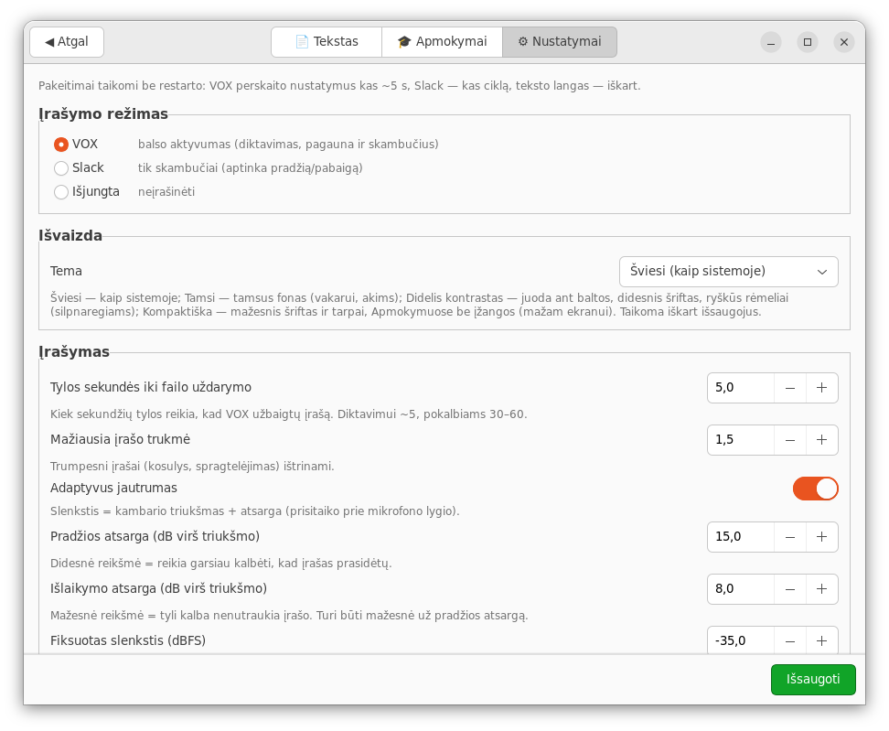
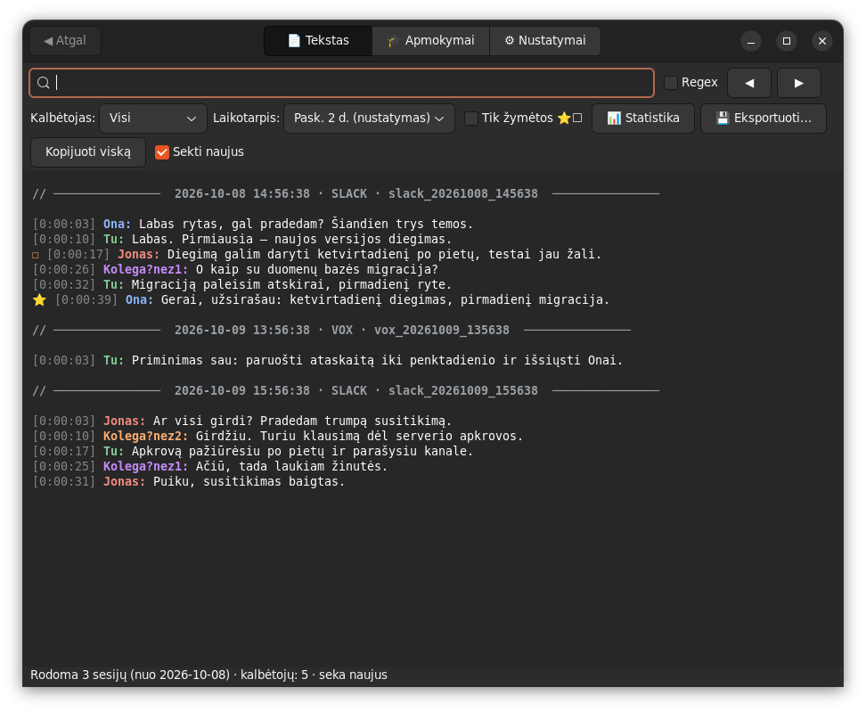
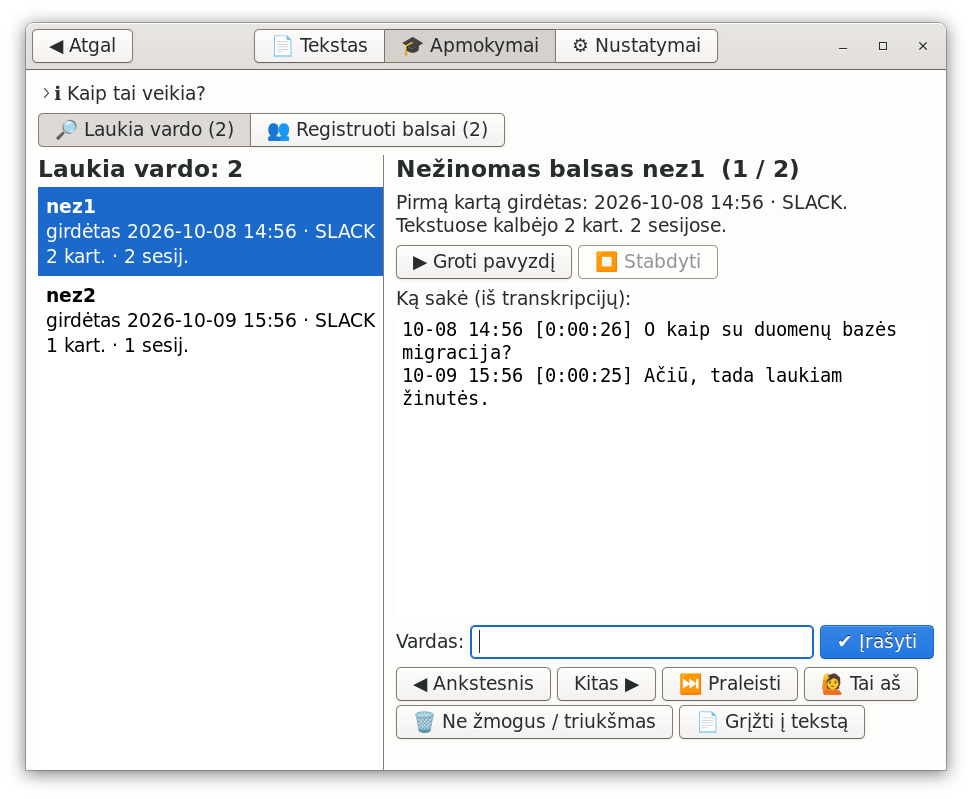
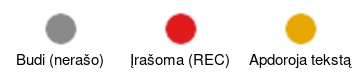

# Diktatūra 🎙️→📝

**Nemokamas, lokalus (privatus) balso-į-tekstą įrankis Linux vartotojams.**
Automatiškai įrašo Slack skambučius ar diktavimą, transkribuoja **lietuviškai**, atpažįsta
kalbėtojus **vardais** — ir viskas vyksta tavo kompiuteryje, niekur nesiunčiama.

> *Free, local, privacy-first Lithuanian speech-to-text for Linux. Auto-records Slack calls or
> dictation, transcribes in Lithuanian, labels speakers by name — 100% offline.*

Panašus į komercinius diktavimo įrankius, bet **atviras, nemokamas ir pilnai vietinis**.
Pavadinimas — kalambūras: *dikta*-vimas + *diktatūra* 🙂.

> ⚠️ Nesusijęs su jokiu komerciniu produktu. Naudoja atviro kodo modelius ir įrankius.

---

## Kaip atrodo

Vienas langas „Diktatūra" su trimis skiltimis. **📄 Tekstas** — gyvai besipildančios transkripcijos: žmonės
atpažinti vardais (kiekvienas sava spalva), sesijų skyrikliai, paieška, filtrai, žymės ir grojimas nuo bet kurios
eilutės:



**🎓 Apmokymai** — kai kalba nepažįstamas balsas, jis tekste pažymimas „Kolega?nezN". Čia jo paklausai, matai, ką
sakė, ir įrašai vardą — nuo tada atpažįstamas automatiškai, o seni tekstai pasitaiso patys (kol groja perklausa,
Diktatūra jos neįrašinėja):



**⚙ Nustatymai** — viskas su paaiškinimais lietuviškai; pakeitimai veikia iškart, be perkrovimo. Apačioje
„Atstatymas ir duomenys": atkurti numatytus nustatymus ir **ištrinti įrašus ir tekstus** (pradėti kaupti iš naujo;
vardų atpažinimas lieka, nebent pažymėsi) — abu tik patvirtinus:



**🎨 Temos** (Nustatymai → Išvaizda): šviesi (kaip sistemoje), tamsi, **didelis kontrastas ir šriftas** (silpnaregiams)
ir **kompaktiška** (mažam ekranui — mažesnis šriftas, be įžangų). Langą galima sumažinti iki ~670×320, mygtukų
juostos persikelia į kelias eilutes, o kas netelpa — slenkama:

| Tamsi | Didelis kontrastas |
|---|---|
|  |  |

**Status bar ikona** rodo, kas vyksta — pilka budi, raudona įrašo, geltona apdoroja; pulsuoja, kai laukia
nežinomų balsų. Paspaudus — meniu (⚙ Nustatymai viršuje), vidurinis klik — iškart Nustatymai:



*(Ekranuose — pavyzdiniai vardai ir tekstas, ne tikri duomenys.)*

---

## Ką daro

- 🤖 **Pats įsijungia** — aptinka Slack skambutį ir automatiškai pradeda/sustabdo įrašymą; arba **VOX** režimas
  (balso aktyvumas) diktavimui bet kada. Veikia fone (systemd), startuoja po kompiuterio perkrovimo.
- 📝 **Transkripcija lietuviškai** — [Ąžuolas](https://huggingface.co/akisviete/azuolas-whisper-lt)
  (whisper-large-v3 + LIEPA-3) per faster-whisper (CT2, int8). Geriausia LT kokybė (testuose WER ~2–3 %).
- 👥 **Atpažįsta žmones vardais** — stereo (tavo mikrofonas vs sistemos garsas) + balso „pirštų atspaudai"
  (sherpa-onnx, be torch). Tekste: `Tu / Jonas / Petras: …`. Nežinomus balsus išmokai **Apmokymuose**.
  Griežtai: jei balsas nepakankamai aiškiai panašus į vieną žmogų — `Kolega?`, o ne spėtas vardas. Suklydo? Dešinys
  klik ant eilutės → **✎ Kas kalbėjo?** — eilutė pataisoma, o balsas išmokstamas (taip pat ir tavo, kai kalbi
  prisijungęs telefonu).
- 🔇 **Kalbos filtras** — įrašai be kalbos (kosulys, triukšmas, muzika) atmetami dar prieš kraunant modelį.
- 🎧 **Be aido tavo eilutėse** — jei kolegų garsas iš ausinių elektriškai prasiskverbia į mikrofoną (dažna su
  ausinėmis kompiuterio lizde), jo kopija prieš transkripciją atimama (sistemos garso kanalas — tikslus etalonas).
- 📚 **Kaupia tekstą** — visos transkripcijos vienoje vietoje, gyvai pildosi; paieška (ir regex), filtrai pagal
  kalbėtoją ir laikotarpį (iki viso archyvo), ⭐ žymės ir ☐ užduotys, **▶ grojimas nuo eilutės**,
  📊 statistika (kas kiek kalbėjo; galima nunulinti), 💾 eksportas į .txt / .md.
- 🌙 **Lankstus režimas** — iškart po skambučio arba naktinis paketinis transkribavimas (01:30);
  pasirinktinai — nuolat įkrautas modelis greitesniam tekstui po diktavimo.
- 💾 Po transkripcijos garsas suspaudžiamas į mp3 (vietos taupymui); tušti — ištrinami.
- 🩺 `make doctor` — savitikra su patarimais; debug žurnalas problemoms gaudyti.

## Privatumas

Viskas vyksta **lokaliai**. Garsas, transkripcijos ir balso „pirštų atspaudai" niekada
neišeina iš tavo kompiuterio. Jokio debesies.

## Reikalavimai

- Linux (testuota Ubuntu 22.04, GNOME, X11), PulseAudio / PipeWire (pulse).
- `ffmpeg`, `python3` (su `gi`), [`uv`](https://github.com/astral-sh/uv), `make`, `curl`.
- GNOME tray ikonai: `gir1.2-ayatanaappindicator3-0.1` + „AppIndicator" plėtinys.
- Vietos: `.venv` ~0.7 GB, Ąžuolas CT2 int8 ≈ 1.5 GB (konversijos metu laikinai ~8–10 GB).
- RAM: Ąžuolui ~3.5 GB laisvos transkripcijos metu. CPU pakanka (GPU nebūtina).

## Diegimas

```bash
git clone https://github.com/SimonasJurksa/diktatura.git && cd diktatura
make deps            # sistemos paketai (sudo apt)
make install         # .venv (be torch) + kalbėtojų modeliai + servisai: ikona, naktinis 01:30, Slack režimas
make model-convert   # Ąžuolas -> CT2 (vienkartinė konversija; torch tik laikinai)
make doctor          # ar viskas veikia (savitikra)
```

Kodas lieka ten, kur klonavai; **duomenys — už repo ribų**:
nustatymai `~/.config/diktatura/`, įrašai/tekstai/balsai/modeliai `~/.local/share/diktatura/`, logai `~/.local/state/diktatura/`.
Pašalinti servisus: `make uninstall` (duomenys lieka).

## Naudojimas

```bash
make status               # kas vyksta: režimas, įrašai, RAM
make doctor               # savitikra: ar viskas sudiegta ir veikia (✓/⚠/✗ + ką daryti)
make mode-slack           # 💬 Slack skambučių aptikimas
make mode-vox             # 🎙️ balso aktyvumas (diktavimui, be Slack)
make immediate | defer    # transkribuoti iškart / naktį (01:30)
make transcribe-pending   # sutranskribuoti viską dabar
make text                 # langas: 📄 Tekstas   (make training — 🎓 Apmokymai, make settings — ⚙ Nustatymai)
make tray-on              # grąžinti ikoną (jei meniu paspaudei „Išeiti" — įrašymas tuo metu veikia toliau)
make desktop              # „Diktatūra" programų meniu (prisegama prie doko: grąžina ikoną ir atidaro langą)
make config               # nustatymai;  make set S="VOX_SILENCE_SEC=3"  (veikia be restarto)
make asr-server-on        # ⚡ nuolat įkrautas modelis — greitesnis tekstas po diktavimo (~3 GB RAM; off — išjungti)
make debug-on             # 🐞 detalus žurnalas problemoms gaudyti (make dlogs — gyvai; make debug-off)
make help                 # visos komandos
```

### Kalbėtojų vardai

Patogiausia — **🎓 Apmokymai** lange (ikonos meniu „Apmokymai paruošti (N)" arba `make training`): paklausyk,
pažiūrėk, ką sakė, įrašyk vardą (jei tai tu pats — „🙋 Tai aš"). Ten pat galima pervadinti ar sujungti registruotus
balsus. Jei vardas parašytas klaidingai — **📄 Tekstas**, dešinys klik ant eilutės → „✎ Kas kalbėjo?": eilutė
pataisoma ir balsas išmokstamas. Griežtumas — **⚙ Nustatymai → Kalbėtojai** (slenkstis ir atsarga iki antro
kandidato). Komandinėje eilutėje:

```bash
make name-unknown                 # nežinomi balsai (pavyzdžiai) + komanda paklausyti
make assign ID=nez3 NAME=Jonas    # priskirti vardą (įsimenamas ateičiai; tekstuose pakeičiamas; NAME=Tu — tavo balsas)
make speakers-relabel DAYS=2      # perskaičiuoti kalbėtojus paskutinių dienų tekstuose (APPLY=1 — perrašyti)
```
Atnaujinus iš senesnės versijos (iki 2026-10-09) balso modelis pasikeitė: `make models` ir
`make speakers-migrate APPLY=1` (seni balsai archyvuojami, vardai išmokstami iš naujo — `make doctor` primins).
Balsai laikomi lokaliai (`~/.local/share/diktatura/speakers/`, **niekada ne repo**).

## Architektūra (trumpai)

- `diktatura/` — Python paketas: `audio/` (VOX, kalbos filtras), `asr/` (transkripcija + vardai, nuolatinis serveris),
  `speakers/` (balsų atpažinimas, saugykla), `ui/` (ikona, langas: Tekstas · Apmokymai · Nustatymai),
  `paths.py` (visi keliai), `config.py` (nustatymai), `doctor.py` (savitikra).
- `bin/` — shell įėjimai (Slack daemon, transkripcijos eilė, naktinis, rankinis įrašymas).
- `systemd/` — servisų šablonai; `tools/` — modelių konversija/atsisiuntimas, benchmark.
- `Makefile` — visas valdymas. Numatytieji nustatymai — `config/diktatura.conf.default`.
- Plačiau: [docs/ARCHITECTURE.md](docs/ARCHITECTURE.md). Prisidėti: [CONTRIBUTING.md](CONTRIBUTING.md)
  (`make test` — ~1 min, `make test-full`, `make test-e2e`).

## Padėka / modeliai

- Ąžuolas (LT ASR) — `akisviete/azuolas-whisper-lt` (whisper-large-v3 + LIEPA-3).
- [faster-whisper](https://github.com/SYSTRAN/faster-whisper), [sherpa-onnx](https://github.com/k2-fsa/sherpa-onnx).

## Licencija

MIT (žr. `LICENSE`). Modeliai — pagal jų atskiras licencijas.
